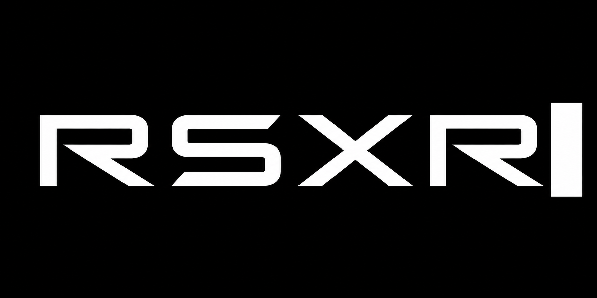

  

# RSXR

RSXR is an early extended reality project built on the Ramp-stack.

It’s built on the same foundations and ideas as OpenXR, but focused on being simpler to work with in Rust and WGPU based systems.

The goal isn’t to be a full engine. It’s a base layer you can actually build on without fighting it.

---

## What it is

- XR foundation built in Rust  
- Uses WGPU for rendering  
- Event-driven (not ECS)  
- Cross-platform direction via OpenXR style structure  

---

## Why it exists

Most XR stacks feel heavy or overly abstract.

RSXR tries to stay close to the system while still being usable. You handle the logic, the runtime handles the hard parts.

---

## Stack

- Rust  
- WGPU  
- Ramp-stack  
- OpenXR concepts  

---

## Status

Early work in progress. APIs will change.
